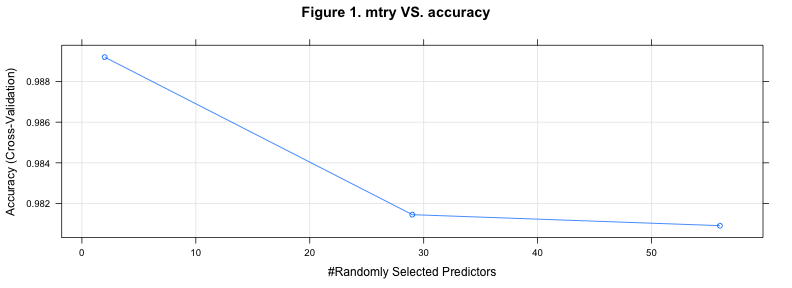
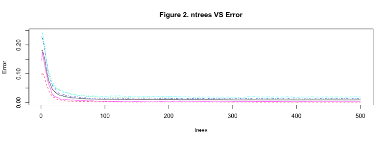

## Summary

Using devices such as Jawbone Up, Nike FuelBand, and Fitbit it is now possible to collect a large amount of data about personal activity relatively inexpensively. These type of devices are part of the quantified self movement - a group of enthusiasts who take measurements about themselves regularly to improve their health, to find patterns in their behavior, or because they are tech geeks. One thing that people regularly do is quantify how much of a particular activity they do, but they rarely quantify how well they do it. 

Our goal is be to use data from accelerometers on the belt, forearm, arm, and dumbell of 6 participants. They were asked to perform barbell lifts correctly and incorrectly in 5 different ways. 

## Objective

The goal of this project is to predict the manner in which the users did the exercise. This is the "classe" variable in the training set. We may use any of the other variables to predict with. For this first we had to choose the training and test sets, then we proceeded to clean the data, removing those variables that are not significant for the model or has missing values. After that we fitted a random forest model using the remaining variables. Finally we tested our model with the test set and measure how accurate our model is.

## Building the Model

The first thing to do is read the data and divide it two sets, the training set and the test set. The test set is used to train the model that will fit the data, and the test set serves to measure the accuracy of the model. In this case we used 75% of the data in the training set, and 25% in the test set.


```r
data <- read.csv("pml-training.csv")

inTrain <- createDataPartition(y=data$classe,p=0.75,list=FALSE)

training <- data[inTrain,]
testing <- data[-inTrain,]

n <- ncol(training)
m <- ncol(training)
```

Once we loaded the data, we must clean it. First we have to get rid of the variables which are not important for the model, we accomplished this by doing a "near zero variance" test. This tell us which variables have small variability, and for consequence have not influence in the model.


```r
nzv <- nearZeroVar(training,saveMetrics=TRUE)
nzvCols <- nzv$nzv
training <- training[,!nzvCols]
testing <- testing[,!nzvCols]
```

The number of variables, excluding the outcome, was originally 159, after removing those variables with almost zero variability, the total number of variables was reduced to 101.

The next step was to reduce even more the number of variables, so we removed all non-numeric variables, eliminating this way all factor variables, also we removed all the remaining variables with NA values. This decision was made only to pre-process the training and testing data in an easier way.


```r
lnumeric <- sapply(training,is.numeric)
numtrain <- training[,lnumeric]
numtest <- testing[,lnumeric]

naID <- rep(TRUE,ncol(numtrain))

for(i in 1:ncol(numtrain))
{
    if(sum(is.na(numtrain[,i])) > 0)
    {
        naID[i] <- FALSE
    }
}

numtrain <- numtrain[,naID]
numtest <- numtest[,naID]
```

The number of variables after this is 56. Now we can fit a model to the data, for this case we used a random forest, because its ability to fit non-linear models with high rate of accuracy for big data sets. We set parameters to pre-process the data with Principal Component Analysis (PCA) to reduce the amount of variables and also set a cross-validation method in order to reduce the the training time.

The training process takes a while, around 40 minutes. For convenience I will load the information from a RData file which I previously created, but I will comment the code used to crx??eate the model.


```r
#modelFit <- train(training[,m] ~ ., method="rf", preProcess="pca", trControl=trainControl(method="cv"),data=numtrain)
options(digits=5)
modelFit
```

```
## Random Forest 
## 
## 14718 samples
##    55 predictors
##     5 classes: 'A', 'B', 'C', 'D', 'E' 
## 
## Pre-processing: principal component signal extraction, scaled, centered 
## Resampling: Cross-Validated (10 fold) 
## 
## Summary of sample sizes: 13247, 13246, 13246, 13247, 13248, 13247, ... 
## 
## Resampling results across tuning parameters:
## 
##   mtry  Accuracy  Kappa  Accuracy SD  Kappa SD
##   2     0.99      0.99   0.0034       0.0043  
##   29    0.98      0.98   0.0062       0.0078  
##   56    0.98      0.98   0.0059       0.0075  
## 
## Accuracy was used to select the optimal model using  the largest value.
## The final value used for the model was mtry = 2.
```

The **train** function applied a PCA before the training and also scaled the data. It used a K-fold cross validation with K=10. The best accuracy was 0.99, which was obtained using a $mtry=2$.


```r
modelFit$preProcess
```

```
## 
## Call:
## "scrubed"
## 
## Created from 14718 samples and 56 variables
## Pre-processing: principal component signal extraction, scaled, centered 
## 
## PCA needed 27 components to capture 95 percent of the variance
```

As we can see, at the end, from the original 159 variables, the model can only use 27 features to capture 95% of the variance, but we are not done yet, in order to check that the model actually fits the data we have to test it with the test set, and we can obtain that information with following command.


```r
m <- ncol(training)
confusionMatrix(testing[,m],predict(modelFit,numtest))
```

```
## Confusion Matrix and Statistics
## 
##           Reference
## Prediction    A    B    C    D    E
##          A 1395    0    0    0    0
##          B    0  941    8    0    0
##          C    0    1  854    0    0
##          D    0    0    3  801    0
##          E    0    0    0    1  900
## 
## Overall Statistics
##                                         
##                Accuracy : 0.997         
##                  95% CI : (0.995, 0.999)
##     No Information Rate : 0.284         
##     P-Value [Acc > NIR] : <2e-16        
##                                         
##                   Kappa : 0.997         
##  Mcnemar's Test P-Value : NA            
## 
## Statistics by Class:
## 
##                      Class: A Class: B Class: C Class: D Class: E
## Sensitivity             1.000    0.999    0.987    0.999    1.000
## Specificity             1.000    0.998    1.000    0.999    1.000
## Pos Pred Value          1.000    0.992    0.999    0.996    0.999
## Neg Pred Value          1.000    1.000    0.997    1.000    1.000
## Prevalence              0.284    0.192    0.176    0.164    0.184
## Detection Rate          0.284    0.192    0.174    0.163    0.184
## Detection Prevalence    0.284    0.194    0.174    0.164    0.184
## Balanced Accuracy       1.000    0.998    0.994    0.999    1.000
```

The first thing to notice here is the accuracy of 0.99, which means that the model does not only fit the training data, but it also fits the test data as well. The second thing that catches my attention is the confusion matrix, there we can see how well (or bad) was our method with the test data, for example we can see how it classified correctly all exercises of class A, and for class B and E it only did one mistake on each. For class D it misclassified only three entries with class C, but the rest was classified correctly. Finally the class that had the most number of mistakes was class B, who mistook eight entries with class C.

The out of bag error (OOB) is 0.88%, which is pretty good, this error is computed during the construction of the random forest. Essentially, any example not selected for a single tree's bootstrap sample can be used to test the model's performance. At the end of the forest construction, the predictions for each example it was held out are tallied, and a vote is taken to determine the final prediction for the example. the total error rate of such prediction becomes the out-of-bag error rate.


```r
modelFit$finalModel
```

```
## 
## Call:
##  randomForest(x = x, y = y, mtry = param$mtry) 
##                Type of random forest: classification
##                      Number of trees: 500
## No. of variables tried at each split: 2
## 
##         OOB estimate of  error rate: 0.88%
## Confusion matrix:
##      A    B    C    D    E class.error
## A 4182    1    0    0    2  0.00071685
## B   19 2812   17    0    0  0.01264045
## C    0   21 2532   12    2  0.01363459
## D    0    1   41 2366    4  0.01907131
## E    0    0    1    9 2696  0.00369549
```

Figure 1 shows the accuracy for different values of $mtry$, where the best accuracy is obtained when $mtry=2$. On the other hand, figure 2 represent the error rate agains the number of trees, and it can be easily seen that the error decreases if the number of trees increase.

 

 
